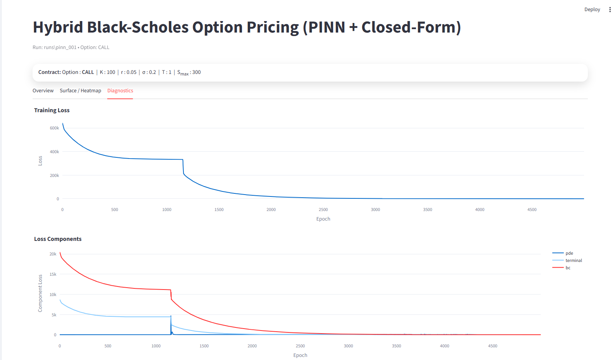
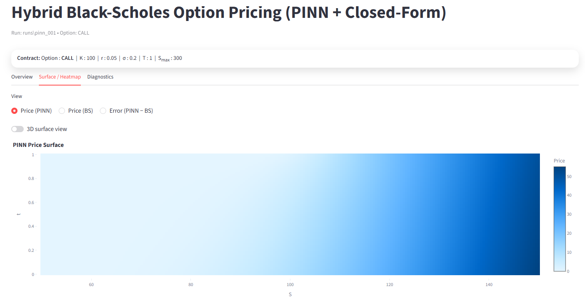
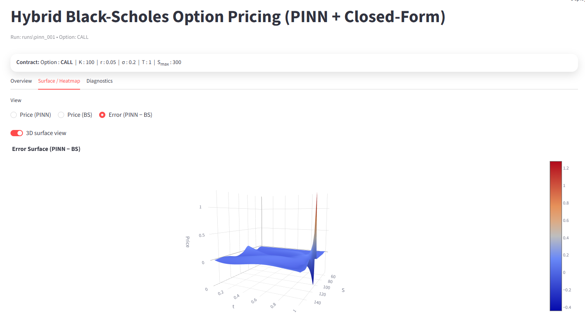
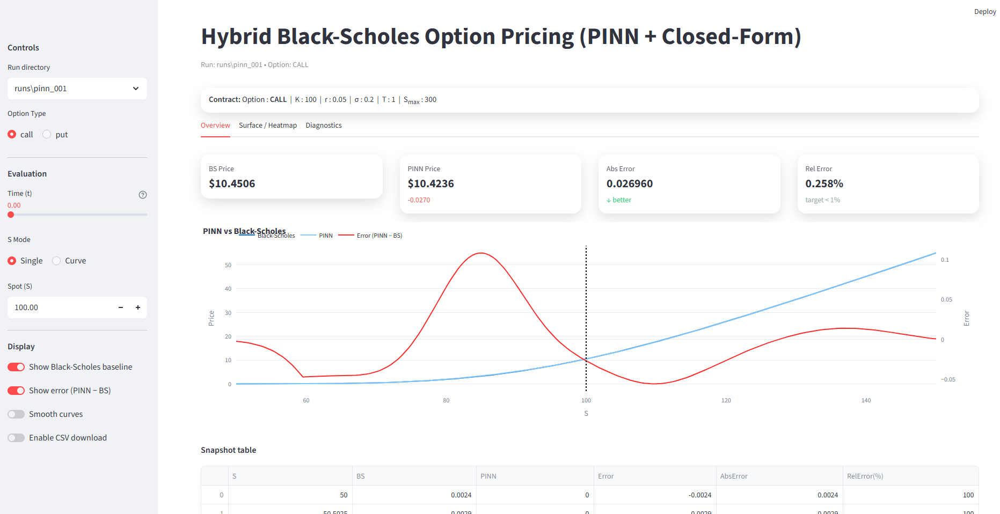

# Hybrid Black–Scholes Option Pricing via Physics-Informed Neural Networks (PINNs)

A physics-informed neural network (PINN) framework for solving the Black–Scholes partial differential equation (PDE) for European options. The model enforces the governing PDE, terminal payoff, and boundary conditions through constrained optimization and achieves sub-1% relative error versus the analytical Black–Scholes solution.

An interactive Streamlit dashboard is included for evaluation, surface visualization, and diagnostics.

---

## Motivation

Closed-form solutions exist for European options under Black–Scholes assumptions. However, many real-world derivatives (American options, stochastic volatility models, multi-asset contracts) do not admit analytical solutions.

Physics-informed neural networks provide a principled way to:

- Solve PDEs without discretization grids
- Enforce governing physics directly through residual minimization
- Generalize to higher-dimensional financial models

This project demonstrates a full PINN pipeline applied to a canonical financial PDE, validated rigorously against the analytical benchmark.

---

## Mathematical Formulation

### The Black–Scholes PDE

$$
\frac{\partial V}{\partial t} + \frac{1}{2}\sigma^2 S^2 \frac{\partial^2 V}{\partial S^2} + rS\frac{\partial V}{\partial S} - rV = 0
$$


**Subject to:**

**Terminal Condition:**

- **Call:** $V(S,T) = \max(S - K, 0)$
- **Put:** $V(S,T) = \max(K - S, 0)$


**Boundary Conditions:**
- $V(0, t)$
- $V(S_{\max}, t)$

---

## Physics-Informed Neural Network Design

### Network Architecture

- Fully connected MLP
- Tanh activation
- Float64 precision (critical for second derivatives)
- **Input normalization:**
  - $S \rightarrow S/S_{\max}$
  - $t \rightarrow t/T$

### Loss Function

$$
\mathcal{L} = w_{\text{pde}} \cdot \mathcal{L}_{\text{PDE}} + w_{\text{terminal}} \cdot \mathcal{L}_{\text{terminal}} + w_{\text{boundary}} \cdot \mathcal{L}_{\text{boundary}}
$$

**Where:**

- **PDE residual** computed via automatic differentiation (first and second derivatives)
- **Terminal loss** enforces payoff
- **Boundary loss** enforces asymptotic constraints

---

## Numerical Stability & Engineering Decisions

This implementation addresses key PINN challenges:

### 1. Float64 Precision
Second derivatives are sensitive to numerical instability. Training is performed in float64 to maintain stable PDE residual computation.

### 2. Input Normalization
Scaling $S$ and $t$ stabilizes gradient magnitudes and improves convergence.

### 3. Mixture Collocation Sampling
Interior points are sampled using a mixture distribution concentrated near the strike to better capture curvature around the payoff kink.

### 4. Periodic Resampling
Interior collocation points are resampled during training to prevent overfitting to fixed collocation sets.

### 5. Weighted Multi-Objective Loss
Loss weights balance PDE residual and boundary/terminal constraints to ensure physical consistency.

### 6. GPU → CPU Portability
Models trained on CUDA can be safely loaded for CPU inference via controlled device mapping.

---

## Training Strategy

- **Optimizer:** Adam
- **Precision:** float64
- Collocation resampling interval
- Config-driven reproducible runs
- Automatic config snapshot saving
- Modular checkpoint structure

### Example Convergence Behavior



**Loss components:**
- PDE residual
- Terminal constraint
- Boundary constraint

Stable decay indicates successful constraint enforcement.

---

## Results

### Accuracy vs Analytical Black–Scholes

For baseline contract:

- **Call relative error:** ~0.25%
- **Put relative error:** ~0.6%


### Surface Solution

The learned solution forms a smooth surface over asset price and time:





**The surface preserves expected properties:**
- Convexity in $S$
- Monotonicity (call increasing, put decreasing)
- Time-value decay toward maturity

---

## Interactive Dashboard

The Streamlit application enables:

- Multiple trained run selection
- Call/Put toggle
- Spot evaluation or price curve mode
- Analytical baseline comparison
- Relative error visualization
- Surface / heatmap view
- Training diagnostics
- Checkpoint reload capability

**Launch:**
```bash
streamlit run app/app.py
```



---

## Project Architecture

```
hybrid-black-scholes-option-pricing-pinn/
│
├── app/                  # Streamlit interface
│   ├── services/         # Model loading & inference
│   ├── ui/               # Layout & components
│   └── app.py
├── configs/              # Config-driven experiments
├── data/                 # mc dataset
├── docs/                 # expression explaination
├── env/                  # project dependencies
├── reports/              # Figures
├── runs/                 # Checkpoints & histories
├── scripts/              # run scripts
├── src/                  # Core PINN training
│   ├── models/
│   ├── losses/
│   ├── physics/
│   ├── data/
│   └── training/
│
├── tests/                # test functions
│
└── README.md
```

---

## Example Trained Contracts

- **Baseline:** T=1.0, σ=0.2
- Short maturity / low volatility
- High volatility regime

Demonstrates stability across parameter regimes.

---

## What This Project Demonstrates

- Implementation of PDE-constrained deep learning
- Correct use of automatic differentiation for second-order derivatives
- Numerical stability awareness in PINNs
- Constraint-balanced training design
- Reproducible ML experiment structure
- Full pipeline from research model to interactive deployment

---

## Future Extensions

- American option free-boundary formulation
- Stochastic volatility (Heston PDE)
- Multi-asset derivatives
- Adaptive residual weighting
- Uncertainty quantification

---

## Technical Stack

- Python
- PyTorch
- NumPy
- Plotly
- Streamlit

---

## License

[Add your license here]
